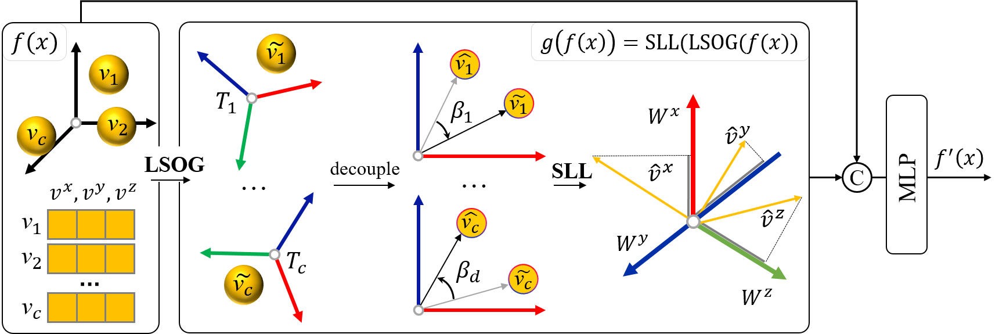

# EquiSym: Learning Equivariant Representations of Vector Neurons without Self-Symmetry Ambiguity
SO(3) equivariant models provide excellent pose representations for tasks such as pose estimation, which involve rotation group asymmetries. However, input objects with self-symmetry introduce additional symmetry, causing the equivariant representations to exhibit zero-valued components along symmetric directions, thereby introducing ambiguities in neural network training. In this work, we address this issue by inserting a non-zero guidance term into the equivariant function. Under the Vector Neuron (VN) framework, we propose the Learnable Special Orthogonal Group (LSOG) and Separable Linear Layers (SLL) to construct the non-zero guidance term.


# Data Preparation
1.Download[ModelNet40](https://shapenet.cs.stanford.edu/media/modelnet40_normal_resampled.zip), and place it in the following directory:  `datasets/modelnet40_normal_resampled/`.
2.Download[ShapeNet](https://condor-datasets.s3.us-east-2.amazonaws.com/dataset/ShapeNetAtlasNetH5_1024.zip), and place it in the following directory: `datasets/ShapeNetAtlasNetH5_1024/`.
3.Download[ScanObjectNN](ScanObjectNN), and place it in the following directory: `datasets/ScanObjectNN`.

# Environment Preparation
We tested the code on pytorch1.10 (cuda11.1).
`pip install torch==1.10.1+cu111 torchvision==0.11.2+cu111 torchaudio==0.10.1 -f https://download.pytorch.org/whl/cu111/torch_stable.html`

# Usage
## Single-Category Training/Testing
```bash
python train_pose.py --model $optional$ --data_choice shapenet
python test_pose.py --model $optional$ --data_choice shapenet
```
## Multi-Category Training/Testing
```bash
python train_pose.py --model $optional$ --data_choice modelnet
python test_pose.py --model $optional$ --data_choice modelnet
```
## Real-World Data Training/Testing
```bash
python train_pose.py --model $optional$ --data_choice scanobject
python test_pose.py --model $optional$ --data_choice modelnet
```
Here, `$optional$` can be one of the following: `vn_pointnet`, `vn_dgcnn`, `vn_transformer`, `vn_pointnet_am`, `vn_dgcnn_am`, `vn_transformer_am`. The suffix `_am` indicates that our method was used.

# License
MIT License


# Acknowledgement
This repository is built upon the following works:  [PointNet/PointNet++](https://github.com/yanx27/Pointnet_Pointnet2_pytorch), [DGCNN](https://github.com/WangYueFt/dgcnn), [VNN](https://github.com/FlyingGiraffe/vnn), [OAVNN](https://github.com/sidhikabalachandar/oavnn) and [VN-Transformer](https://github.com/lucidrains/VN-transformer). We gratefully acknowledge the authors for their foundational contributions.

